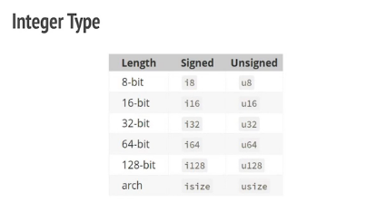

## Variable bindings , Constants & Statics

⭐️- In Rust variable are **immutable** by default, so we call them Variable bindings. To make them mutable, `mut` keyword is used.

⭐️- Rust is a **statically typed** language; It checks data type at compile time. But it **doesn’t require you to actually type it when declare variable bindings**. On that case compiler checks the usage and set a better data type for it. But for constants and statics you must annotate the type. Types come after a colon(:)

```
let a = true;
let b: bool = true;

let (x, y) = (1, 2);

let mut z = 5;
z = 6;


const N: i32 = 5;

static N: i32 = 5;

```

- let keyword is used in binding expressions. We can bind a name to a value or a function. Also because of left-hand side of a let expression is a ‘pattern’, you can bind multiple names to set of values or function values.

- const keyword is used to define constants. It lives for the entire lifetime of a program but have no fixed address in memory. static keyword is used to define ‘global variable’ type facility. There is only one instance for each value, and it’s at a fixed location in memory.

- Always use const, instead of static. It’s pretty rare that you actually want a memory location associated with your constant, and using a const allows for optimizations like constant propagation not only in your crate but also in downstream crates.

- 💡Usually statics are placed at top of the code file, outside the functions.

- Shadowing is declaration of new varaible with the same name as previous 

- Shadowing vs Mutable 
    - in shadowing you can change datatype of variable


# Primitive Data types
    - Scaler data types:- contains single value integer, float, char, boolean
    - Compound datatypes:- containse multiple datatypes tuple, array

Integer type : 
    Signed : i
    Unsigned: s




How signed and Unsigned data stored in memory

if mbs is 0, then +vs else -ve

Number Literals:- 


## Functions