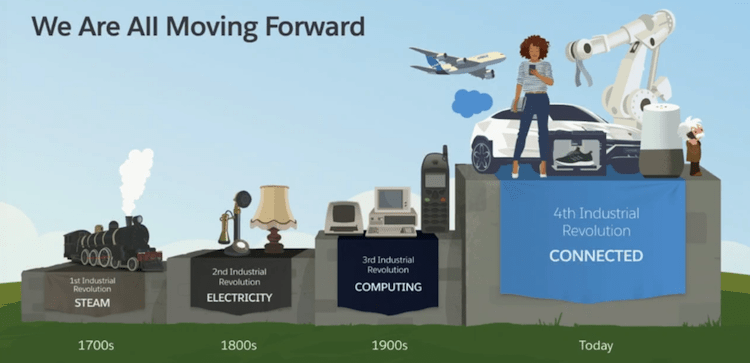

# IoT

1. 

2. 

- Lesston 1

### Fourth Industrial Revolution

In a 2016 [article](https://www.weforum.org/agenda/2016/01/the-fourth-industrial-revolution-what-it-means-and-how-to-respond/), Schwab wrote that “like the revolutions that preceded it, the Fourth Industrial Revolution has the potential to raise global income levels and improve the quality of life for populations around the world.”

He continued: “In the future, technological innovation will also lead to a supply-side miracle, with long-term gains in efficiency and productivity. Transportation and communication costs will drop, logistics and global supply chains will become more effective, and the cost of trade will diminish, all of which will open new markets and drive economic growth.”

 It’s not all good news, however. Schwab also suggested the revolution could lead to greater inequality, “particularly in its potential to disrupt labor markets.” Furthermore, the job market may become increasingly segregated into “low-skill/low-pay” and “high-skill/high-pay” roles, which could escalate social tension.

According to Schwab, “the changes are so profound that, from the perspective of human history, there has never been a time of greater promise or potential peril.”

What are the technologies driving change?

- **Edge Computing** 

- Lesson 2

    - Value proposion :- data privacy, 
    - Layers of IOT
    - Past, Present and Future of IOT: Consumer devices will conected in 1st wave, Industrial devices in 2nd wave, and anything that will be benfit in connecting will be connected in 3rd wave.
    - Embedded Systems:- all complexity are embeded into the device. All IOT things are not Embedded Systems. IoT is primarily a marketing, not an engineering term. When we refer to it in the engineering terms, we normally mean an embedded microprocessor controlled system connected directly or indirectly to the web. On the contrary, a typical distributed embedded system such as a commercial building's lighting or heating system or an enterprise control system is never on the public Internet for obvious IT security reasons. As such, IoT refers to a highly secure and well protected embedded system that's fully controlled by microprocessors. That's one of the notions. Further, IoT is a conceptual framework or an architecture that considers how components will communicate with each other, i.e. very similar to REST. As such, it's wrong to call IoT a technology. So, if your nuclear power plant or a defense system is a closed network that operates in an isolated environment, it's a distributed embedded system. If it's open and scalable, homogeneous, reconfigurable, self-configurable and is taking advantage of machine learning, AI and data analytics.
    - Embedded SS - Sensors sens data and send to micro controller, then micro-contorllser sends data to actuators  to take some actions.
    - Microcontroller characters :- 
    - IOT involves Two compnents :- device and cloud services

- Lession 3
    - Make IOT :- people who do IOT producst as hobby, hobbiest IOT.
    - Consumer IOT :- commercial devices ie. samsung fridge, mi smart 
    - Enterprise IOT:- solve one problme focues on enterprice organization, bit costly and sold to enterprise companies.
    - IOT For Manufacturing:- smart factories, hand free operations
    - IOT Smart City :- traffic, secuirty, enviornemnt, 
    - Retail :- 
    - IOBT Software and Combat Clouds:- soldiers, planes are connected to IOT and can be controlled. Software defined aircraft. combat clouds.
    - Consumer versus Business Goals for IOT
    - IOT Verticals:- Manufacturing, smart city, health care, transporttion, logistics, retail, agriculture, military
    - IoT Architecture & Subsystems :- 
    - IOT Hardware: 
        - Sensors and smarts senssors. smart sensors are directly connectd to cloud but noraml sensors sends data to cloud via gateway.
        - Non-IP Enabled Devices: Not connected to internet directly. will be connected to IOT gateway and gateway connected to internet.
    - Edge Devices and Field Gateways
    - IOT Gateway :- Raspberry Pi.
    - [Edge computing](https://www.ibm.com/cloud/what-is-edge-computing) :- Data is handled or store locally or nearest data store. edge computing means running fewer processes in the cloud and moving those processes to local places, such as on a user’s computer, an IoT device, or an edge server.
    - How does edge computing work? 
        - eduge computing eanble iot devies to funcation without internet and function as stand alone node.

    - Why pure cloud computing is not the best option for IoT ? 
        - Security , eduge incrased data security.
        - Latency , better app performance in edge, reduce latency
        - Operational cost for cloud 

    - Edge Computing Use Cases: 
        - travel, transportation, logistics
        - energy
        - retail
        - healthcare
        - utiliteis

- Lesson 4

    - Voice Assistant in IOT devices:- Home automation, Healthcare, Entertainment, Automobiles
    - Scenarios for Bots :- Helpdesk, Q&A or FAQs, Product selection and Ordering. Cofee Maker
    - Embedded devices with dialogue:- AWS Echo, 
    - [How to develop for the google Assistant Platform: Acation for Google](https://developers.google.com/assistant)
    - Hardware:- 
        - STM32
        - ESP32, chinese, not supported rust yet.
    - Hardware which we will use field gateway Edge: Rasberry PI 4

3. Rus Programming Part 1

- Lesson 1

- Lesson 2

    - Rust : not trade off between security and performance

## Internet of Things (IoT) Basics

> The internet of things is a network of the physical devices and these physical devices can be anything like your Television, Refrigerator, Air conditioner, car etc. with some sensors and actuators in them which help them to communicate with each other and share particular information.

The IoT allows you to control ‘things’ remotely within your network or from any part of the world with the help of internet.
"Things", in the IoT sense, can refer to a wide variety of devices such as heart monitoring implants, biochip transponders on farm animals, cameras streaming live feeds of wild animals in coastal waters, automobiles with built-in sensors, DNA analysis devices for environmental/food/pathogen monitoring, or field operation devices that assist firefighters in search and rescue operations. Legal scholars suggest regarding "things" as an "inextricable mixture of hardware, software, data and service".
These devices collect data with the help of sensors and actuators and then autonomously flow that data between the devices.

### SENSORS:
Sensors sense - that is to say they act as the eyes and ears of your device, and detect changes in the environment around them, providing information for a processor, MCU or other system to react to. In scientific terms they are used to detect any kind of energy and convert it to electrical energy. Example-DHT11 (Temperature and Humidity sensor), LDR (Light sensor) etc.

### Actuators: 
An actuator is a component of a machine that is responsible for moving and controlling a mechanism or system, for example by opening a valve. In simple terms, it is a "mover". An actuator requires a control signal and a source of energy. The control signal is relatively low energy and may be electric voltage or current, pneumatic or hydraulic pressure, or even human power. Its main energy source may be an electric current, hydraulic fluid pressure, or pneumatic pressure. When it receives a control signal, an actuator responds by converting the signal's energy into mechanical motion.

### TRANSDUCERS
TRANSDUCERS in simple words are the devices which are used to convert one form of energy into another form of energy

### Microcontroller: 

A microcontroller is a computer present in a single integrated circuit which is dedicated to perform one task and execute one specific application. It contains memory, programmable input/output peripherals as well a processor.
NO os, bear metal C or Rust programming language.

ESP32, china based. in future rust will be run on this.

### Microprocessor

Microprocessor, any of a type of miniature electronic device that contains the arithmetic, logic, and control circuitry necessary to perform the functions of a digital computer’s central processing unit. In effect, this kind of integrated circuit can interpret and execute program instructions as well as handle arithmetic operations.

## IOT Architecture

It's Internet + things (tv,fridge,bikes + sensors,actuators +  )

Internet of things, Sensors, actuators, transducers , micro-controllers and micro-processors. 

The key elements are - sensors and actuators, devices, gateway, protocol, cloud.

- sensors :- a device that converts phycical data to electrical signals so that micro-processors can perform operations i.e temp, humudity, pressure.
- actuators :- convert electrical signals to mechanical motiion.
- devices
- gateway
- protocol
- cloud

Micro-controllers devices :- single chip device 

